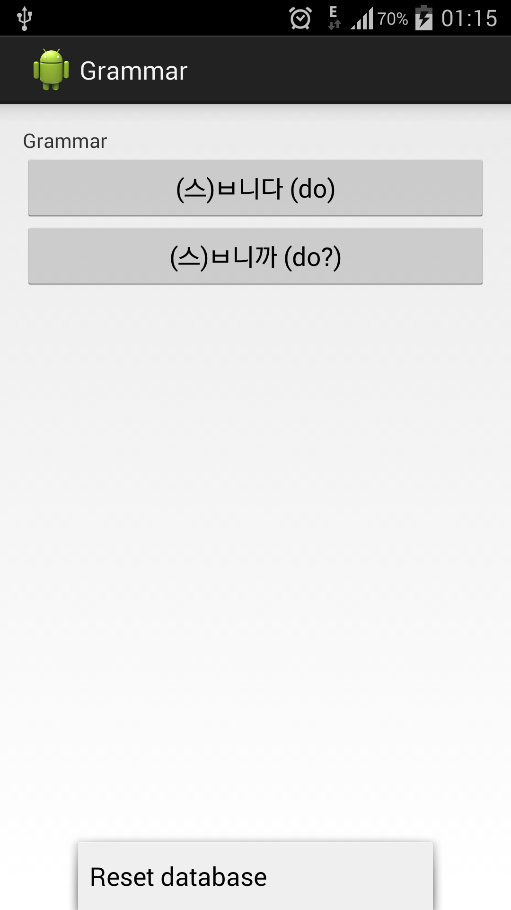
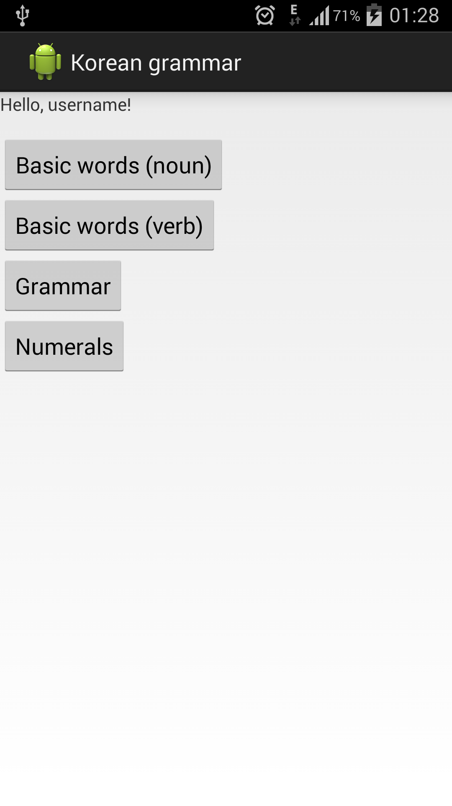
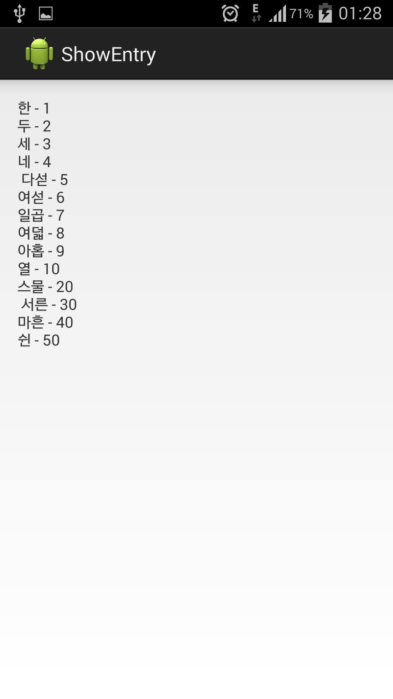
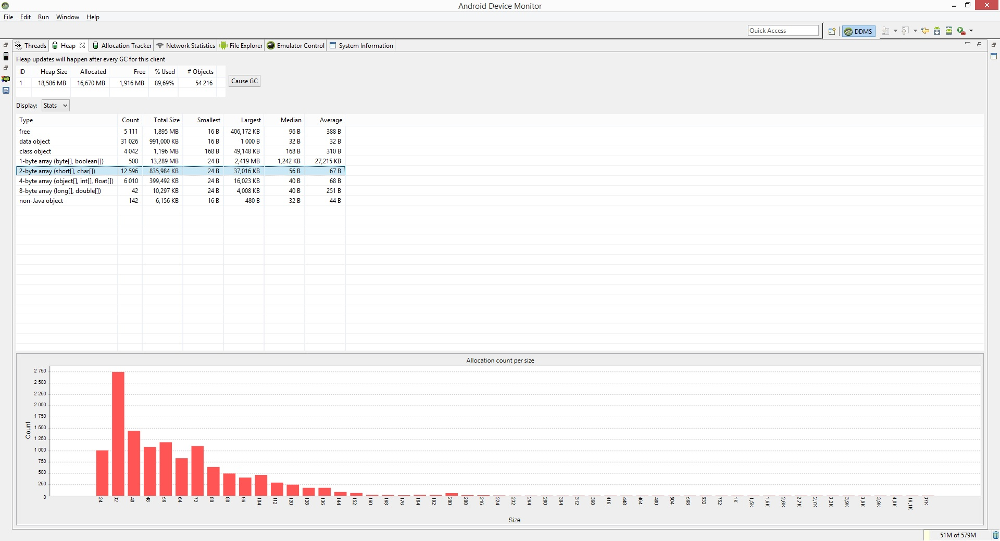

mobile_computations
===================

Project for "Mobile computations" KPI course.

Project team
--------
* Mykola Previr

The idea of project is **Grammar Handbook** (for Korean language).
The developed program is intended to help with studying or revising Korean language.
It contains grammar rule, numerals, basic words with examples of usage.
Features:
* Categorized grammar rules
* Different user categories (user and admin)
* Admins are allowed to edit entries (grammar articles)

#####Laboratory work requirements 
1. Create repo:
Done (as you can see).
2. Create interface:

3. TODO: UML
4. Launch on the device (done).
Authorization (not so done).
5. CPU Profiler:

